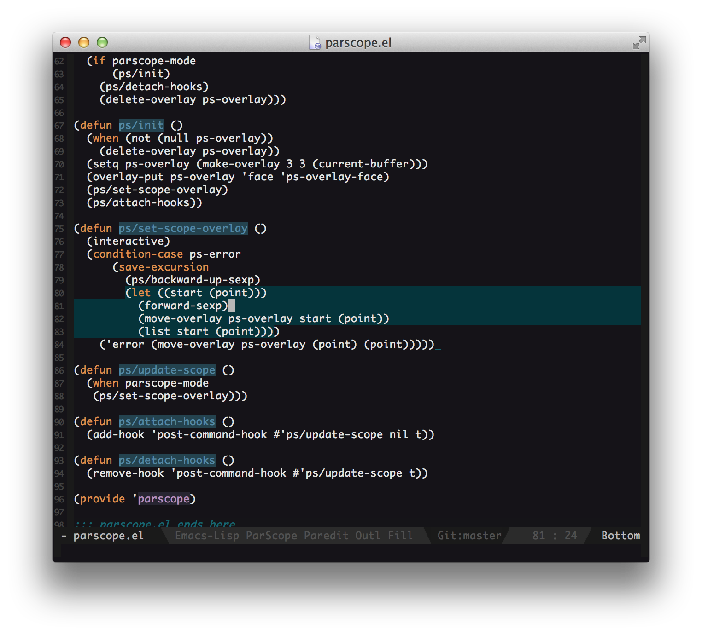

# parscope

*An emacs minor mode for showing the current scope in Lisp-like languages.*

*parscope-mode* highlights the current scope by creating an overlay with
*parscope-overlay-face* that extends to cover the body of the current
S-expression. As you might imagine, this works pretty well in
Lisp-like languages (Common Lisp, Emacs Lisp, Clojure, etc) and even
works somewhat-well for Algol-based languages.

## Installation

Installation is simple - either install it from Marmalade, or copy the
file to your load path and add this to your init file:

    (require 'parscope)

## Usage

To enable *parscope* for the current buffer, use **M-x
parscope-mode**. *parscope* will automatically highlight the current
S-expression's scope. Customize the appearance of the overlay by
tweaking *parscope-overlay-face*.

## TODOs
+ [ ] Mark current scope
